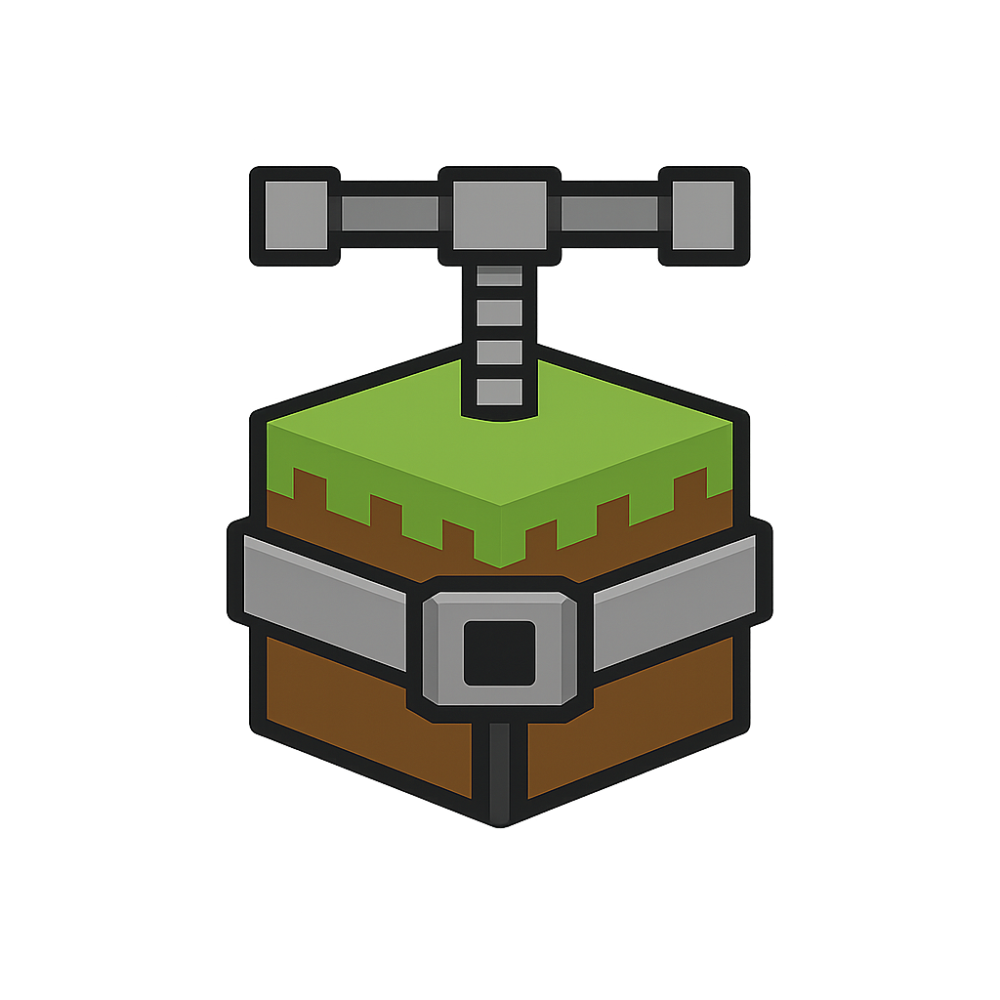

   

# compack

A fast, dependency-light Go alternative to [PackSquash](https://github.com/ComunidadAylas/PackSquash)
for trimming and compacting Minecraft: Java Edition resource and data packs.

**Compression is equal or better than PackSquash on text files (JSON, shaders,
lang, properties), and on par on PNGs and OGGs.** `compack` walks an input
pack directory and writes a single ready-to-use ZIP file with each recognized
file type optimized in parallel, using the same upstream engines PackSquash
relies on OptiVorbis for OGG, oxipng for lossless PNG, and pngquant
(libimagequant) for the optional lossy palette step.

> **Real-world example: [Minebox](https://minebox.co/) resource pack**
>
> | Tool       | Output size | Compression time |
> | ---------- | ----------- | ----------- |
> | Original   | 95.0 MB     |  |
> | PackSquash | ~68.4 MB    | ~124 seconds |
> | compack    | ~66.7 MB (with extra files and overlays) | ~22 seconds |

The difference is philosophy: compack never refuses a file or an unconventional
layout. Pack overlays, extra files and atypical directory structures are passed
through untouched and kept in the output, nothing is enforced.

## What it optimizes

| Files                                  | What it does                                                                          | Lossless? |
| -------------------------------------- | ------------------------------------------------------------------------------------- | --------- |
| `.json` `.jsonc` `.mcmeta` `.mcmetac`  | Strip whitespace + `//` and `/* */` comments; warn when comments appear in strict JSON | byte-identical to strict parse |
| `.png`                                 | Lossily remap RGB/RGBA → 8-bit palette via embedded **pngquant** (libimagequant), then drop ancillary chunks + recompress IDAT with embedded **oxipng** (toggle with `-png-lossy`) | lossless by default; lossy when `-png-lossy` is set |
| `.ogg` `.oga`                          | Repack via embedded **OptiVorbis**: strip comment fields, empty vendor string, deterministic stream serials, smaller pages | **lossless** sample-identical |
| `.vsh` `.fsh` `.glsl`                  | Strip `//` and `/* */` comments, collapse runs of whitespace, drop blank lines        | n/a       |
| `.lang`                                | Drop blank lines and `#` comment lines; keep only `key=value` lines                  | n/a       |
| `.properties`                          | Same as `.lang` but treats both `#` and `!` as comment markers                        | n/a       |

Anything else is passed through unchanged and stored with default ZIP DEFLATE
compression.

## How it compares to PackSquash

compack reaches the **same compression ratios** as PackSquash because it uses
the same upstream tools under the hood (pngquant/libimagequant, oxipng,
OptiVorbis) and the same JSON / shader / lang minification passes. Where the
two diverge is **philosophy**:

- **No format enforcement.** PackSquash validates every file against the
  Minecraft pack spec and refuses to pack anything it considers malformed or
  out of place. compack does not. If a file is recognized it gets optimized;
  if not, it is passed through untouched. You can ship experimental files,
  custom layouts or things PackSquash rejects outright.
- **Pack overlays and extra files.** Because compack never second-guesses your
  directory, it is happy bundling pack overlays, documentation, source
  assets, sidecar metadata or anything else you want inside the ZIP.
- **Implementation.** compack is a small pure-Go CLI, the JSON / shader /
  lang / properties optimizers are standard-library Go and the heavy lifting
  (pngquant, oxipng, OptiVorbis) is done by upstream binaries embedded
  directly into the executable via `//go:embed`. No external binaries are
  looked up on `$PATH` at runtime.

Other niceties:

- Single statically-linked binary with **no external runtime dependencies**.
  Embedded for Linux / macOS / Windows on amd64 + arm64 (`windows/arm64`
  excepted no upstream pngquant build). The macOS `pngquant` blob is a
  universal binary so it covers both amd64 and arm64; the Linux and Windows
  `pngquant` blobs are amd64 only (no official arm64 build ships upstream).
  On platform/GOOS/GOARCH combinations without a `pngquant` blob, the lossy
  palette step is silently skipped and PNGs fall back to lossless oxipng, so
  the build still succeeds.
- Parallel file processing out of the box (`-threads`).
- **Deterministic output**: files in the resulting ZIP are sorted by their
  relative path and OptiVorbis stream serials are bound to a fixed value, so
  two runs on the same input produce byte-identical ZIPs.
- A live **progress bar** on stderr with current-task kind + filename.
- **config.yml** support for setting defaults without retyping flags.

## Installation

```
go install github.com/qore-games/compack@latest
```

Or build from source:

```
git clone <this repo>
cd compack
go build -o compack .
```

Building from source requires network access the first time so the embedded
oxipng / OptiVorbis / pngquant binaries already checked into `optim/bin/` match
the current platform; otherwise the existing files are fine. No external
binaries are looked up on `$PATH` at runtime.

## Usage

```
compack [-flags...] <input-dir> [-out output.zip] [-config config.yml]
```

Flags and positional arguments may appear in any order. Common examples:

```
compack ./my-resourcepack -out pack.zip
compack -png-strip-meta -ogg -json-minify ./my-pack
compack -skip-png-quant ./my-pack                  # disable the lossy palette step (lossless-only)
compack -skip-png -skip-ogg -skip-text ./my-pack   # pass-through (just ZIP everything)
compack -config my-config.yml ./my-pack           # use settings from a config file
```

### config.yml

Drop a `config.yml` in the working directory and compack will auto-load it as
the default for every flag below. Any flag passed on the command line still
overrides the file. Point `-config` at a different path to load that instead.
Keys may be omitted; omitted keys fall back to compack's built-in defaults.

```yaml
out: pack.zip            # -out
threads: 0               # -threads (0 = use runtime.NumCPU())
quiet: false             # -q
verbose: false           # -v
dry_run: false           # -dry-run
no_progress: false       # -no-progress

json:
  minify: true           # -json-minify / -skip-json

png:
  recompress: true              # -png-recompress / -skip-png
  strip_meta: true              # -png-strip-meta
  level: 0                      # -png-level (0 = preset 4, 1-6 presets, >6 = max)
  keep_color_profile: false     # -png-keep-color-profile (keep gAMA/iCCP/cHRM/sRGB)
  lossy_quant: true             # -png-lossy / -skip-png-quant (lossy pngquant pass)
  quant_min: 65                 # -png-quant-min (0-100)
  quant_max: 90                 # -png-quant-max (0-100)

ogg:
  optimize: true                # -ogg / -skip-ogg
  strip_comments: true          # -ogg-strip-comments

text:
  minify: true           # -text-minify / -skip-text
```

### Flags

| Flag                              | Default        | Description |
| --------------------------------- | -------------- | ----------- |
| `-config`                         | `config.yml` (auto) | Path to a config.yml with default settings; loaded automatically when present in the working directory |
| `-out`                            | `pack.zip`     | Output ZIP file path |
| `-threads`                        | `NumCPU`        | Parallel file workers |
| `-q`                              | off             | Suppress per-file log lines (also disables the progress bar) |
| `-v`                              | off             | Verbose log (also lists unchanged files; disables the progress bar) |
| `-dry-run`                        | off             | Walk and optimize, but do not write the ZIP (also disables the progress bar) |
| `-no-progress`                    | off             | Disable the ANSI progress bar even when stderr is a TTY |
| `-json-minify` / `-skip-json`     | on              | Toggle JSON/JSONC/.mcmeta minification |
| `-png-recompress` / `-skip-png`   | on              | Run the embedded oxipng against every PNG |
| `-png-lossy` / `-skip-png-quant`  | on              | Lossily remap RGB/RGBA PNGs to an 8-bit palette via embedded pngquant (libimagequant) **before** the lossless oxipng pass; this is the step that reaches PackSquash-level sizes on photographic textures but is **not** pixel-identical |
| `-png-quant-min`                  | 65              | pngquant `--quality` lower bound (0-100); if the achievable quality would drop below this, the original pixels are kept |
| `-png-quant-max`                  | 90              | pngquant `--quality` upper bound (0-100); higher means more colors retained, larger palette |
| `-png-strip-meta`                 | on              | Tell oxipng to drop ancillary PNG chunks (metadata removal) |
| `-png-level`                      | 0 (= preset 4) | oxipng optimization preset (1-6, 0 = default 4, >6 = `max`) |
| `-png-keep-color-profile`         | off             | Keep `gAMA` / `iCCP` / `cHRM` / `sRGB` / `pHYs` / etc. chunks |
| `-ogg` / `-skip-ogg`             | on              | Toggle lossless OptiVorbis optimization of OGG streams |
| `-ogg-strip-comments`            | on              | Remove Vorbis comment fields (artist/title/etc.); set to `false` to keep them |
| `-text-minify` / `-skip-text`    | on              | Toggle shader/lang/properties minification |

## Contributing

Contributors are welcome. Two areas where help is especially useful:

- **New features**: additional optimizers, presets, output formats, whatever
  makes compack more useful for your packs.
- **Unknown file handling**: today unknown files are passed through untouched.
  Pull requests that teach compack how to optimize or strip more file types
  (model formats, NBT, audio formats beyond OGG, etc.) are a great fit.

Open an issue or PR on the repository.
